# Palette catalog

Every palette bundled with the package - **97** of them: the **7 curated built-in
themes**, the **6 gaming palettes** and the **84 community palettes**. Nothing here needs
a `themes` block in your config - each one is a complete dual light/dark token set that
lives inside the package, so the app's own light/dark toggle (Settings -> Appearance)
keeps working whichever you pick.

**Every one of them also ships a custom loading spinner**, drawn from the palette's name
or colors: Claude's brand star becomes a stag for Everdeer, a great-wave curl for the
Kanagawa family, a curled cat for the Catppuccins, a d-pad for Game Boy. Switching theme
reshapes the glyph immediately, in every open window. The shapes and their spec format
are catalogued in [baseline/SPINNER_SHAPES.md](../baseline/SPINNER_SHAPES.md).

Mario ships as one of the seven built-ins but carries the gaming category, so the app
groups it with the gaming palettes - and so does this catalog: the Gaming section below
has seven cards.

## How to activate a palette

Three ways, all equivalent:

- Press <kbd>Ctrl</kbd>+<kbd>Shift</kbd>+<kbd>T</kbd> anywhere in the app and click a card in
  the [theme picker](README.md#theme-picker-ctrlshiftt). It applies immediately, in every
  open window.
- Open **Settings -> Extra -> Themes** inside the app and click a row.
- Set the slug by hand in `~/.config/Claude/claude-desktop-bin.jsonc`:

  ```jsonc
  { "activeTheme": "rose-pine-moon" }
  ```

Slugs are the palette name lowercased with each run of non-alphanumeric characters
collapsed to a single `-`, so **Rose Pine Moon** is `rose-pine-moon`. Your own themes
take precedence over the built-ins, and the built-ins over the community palettes, so
defining a `themes` entry with the same slug replaces the bundled palette of that name.

## Reading a swatch card

Each card shows the palette's **dark** variant on top and its **light** variant below.
The row background is the content surface; the bubbles are, left to right: elevated
surface, text, primary accent, secondary accent, error, warning, success, border.

## Index

**Built-in:** [Sweet](#sweet) · [Nord](#nord) · [Catppuccin Mocha](#catppuccin-mocha) · [Catppuccin Macchiato](#catppuccin-macchiato) · [Catppuccin Frappe](#catppuccin-frappe) · [Catppuccin Latte](#catppuccin-latte)

**Gaming:** [Mario](#mario) · [PlayStation](#playstation) · [Game Boy](#game-boy) · [Final Fantasy](#final-fantasy) · [Zelda](#zelda) · [Warcraft](#warcraft) · [Dragon Ball](#dragon-ball)

**Community:**

- **A** - [ADW](#adw) · [Atuel](#atuel) · [Ayu Blue](#ayu-blue) · [Ayu Green](#ayu-green) · [Ayu Red](#ayu-red)
- **B** - [Breeze](#breeze)
- **C** - [Catppuccin Frappe Blue](#catppuccin-frappe-blue) · [Catppuccin Frappe Lavender](#catppuccin-frappe-lavender) · [Catppuccin Frappe Mauve](#catppuccin-frappe-mauve) · [Catppuccin Frappe Pink](#catppuccin-frappe-pink) · [Catppuccin Frappe Rosewater](#catppuccin-frappe-rosewater) · [Catppuccin Frappe Sapphire](#catppuccin-frappe-sapphire) · [Catppuccin Lavender](#catppuccin-lavender) · [Catppuccin Macchiato Lavender](#catppuccin-macchiato-lavender) · [Catppuccin Macchiato Mauve](#catppuccin-macchiato-mauve) · [Catppuccin Macchiato Pink](#catppuccin-macchiato-pink) · [Catppuccin Macchiato Rosewater](#catppuccin-macchiato-rosewater) · [Catppuccin Macchiato Sapphire](#catppuccin-macchiato-sapphire) · [Catppuccin Mocha Pink](#catppuccin-mocha-pink) · [Catppuccin Mocha Rosewater](#catppuccin-mocha-rosewater) · [Catppuccin Mocha Sapphire](#catppuccin-mocha-sapphire) · [Cherry Blossom](#cherry-blossom) · [Cream](#cream) · [Cream Autumn](#cream-autumn) · [Creamy Forest](#creamy-forest) · [Cyberpunk](#cyberpunk)
- **D** - [Doomed](#doomed)
- **E** - [Espresso Cream](#espresso-cream) · [Everdeer](#everdeer) · [Everforest](#everforest) · [Everforest Alt](#everforest-alt) · [Everforest Material](#everforest-material)
- **F** - [Flexoki](#flexoki)
- **G** - [Garnet](#garnet) · [GitHub Dark](#github-dark) · [Gruber Darker](#gruber-darker) · [Gruvbox Material](#gruvbox-material) · [GruvboxAlt](#gruvboxalt)
- **H** - [Hexa34C](#hexa34c) · [Horizon](#horizon)
- **J** - [Jiva](#jiva) · [Jiva Lotus](#jiva-lotus) · [Jiva Paper](#jiva-paper)
- **K** - [Kanagawa Dragon](#kanagawa-dragon) · [Kanagawa Kasumi](#kanagawa-kasumi) · [Kanagawa Paper](#kanagawa-paper) · [Kemuri](#kemuri) · [Kemuri Koke](#kemuri-koke) · [Kemuri Susu](#kemuri-susu)
- **L** - [Lilac AMOLED](#lilac-amoled)
- **M** - [Macaron](#macaron) · [Matecito](#matecito) · [Miasma](#miasma) · [Mine](#mine) · [Mizuki-Akiyama](#mizuki-akiyama) · [Monochrome](#monochrome) · [Murasaki](#murasaki) · [Murata](#murata)
- **N** - [NaySayer](#naysayer) · [Neon Surf](#neon-surf) · [Noctalia legacy](#noctalia-legacy) · [Nord Aurora](#nord-aurora)
- **O** - [Oasis Abyss](#oasis-abyss) · [Occult Umbral](#occult-umbral) · [One](#one) · [One Dark Two](#one-dark-two) · [Osaka jade](#osaka-jade) · [Oxide](#oxide) · [Oxocarbon](#oxocarbon)
- **P** - [Paradise](#paradise) · [Peche](#peche)
- **R** - [Rose Pine Alt](#rose-pine-alt) · [Rose Pine Moon](#rose-pine-moon) · [Rose Pine Moon Alt](#rose-pine-moon-alt) · [Rosey AMOLED](#rosey-amoled)
- **S** - [Shien](#shien) · [Shinonome](#shinonome) · [Solarized](#solarized) · [Solarized Osaka](#solarized-osaka) · [Sway Classic](#sway-classic)
- **T** - [Tokyo Night Moon](#tokyo-night-moon) · [Tokyo Night Storm](#tokyo-night-storm)
- **V** - [Vesper](#vesper)
- **Z** - [Zenbones](#zenbones)

## Built-in themes

The curated themes, each with a hand-drawn loading spinner. Details and the spinner spec
are in [README.md](README.md#built-in-themes-dual-variant). Mario is the seventh; it is
catalogued under [Gaming](#gaming-themes).

### Sweet

`"activeTheme": "sweet"` - blush and lavender (light) / deep plum with hot pink (dark), blossom spinner

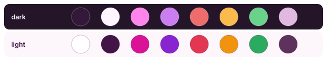

### Nord

`"activeTheme": "nord"` - Nord Snow Storm (light) / Polar Night (dark), snowflake spinner. The slug `nordic` is an alias for this one

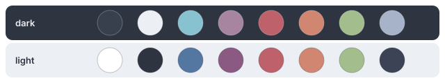

### Catppuccin Mocha

`"activeTheme": "catppuccin-mocha"` - Catppuccin Latte (light) / Mocha with a mauve accent (dark), cat spinner

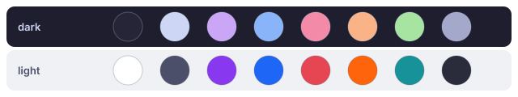

### Catppuccin Macchiato

`"activeTheme": "catppuccin-macchiato"` - Catppuccin Latte (light) / Macchiato (dark), cat spinner

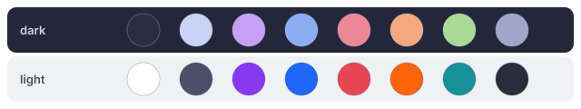

### Catppuccin Frappe

`"activeTheme": "catppuccin-frappe"` - Catppuccin Latte (light) / Frappe (dark), cat spinner

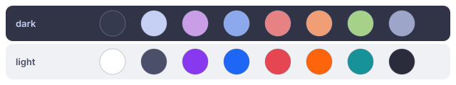

### Catppuccin Latte

`"activeTheme": "catppuccin-latte"` - Catppuccin Latte (light) / Mocha (dark), coffee-cup spinner


## Gaming themes

Seven palettes drawn from games, each with a spinner built for it. They get their own
divider-separated section in the <kbd>Ctrl</kbd>+<kbd>Shift</kbd>+<kbd>T</kbd> picker and
in Settings -> Extra -> Themes. All seven resolve at built-in rank, so `activeTheme` plus
the slug is all a config needs; the six besides Mario are authored in
`js/gaming_themes.json`.

### Mario

`"activeTheme": "mario"` - sky-blue overworld (light) / warm-brick underground (dark), coin-gold and pipe-green status colors. Spinner: the mushroom, bouncing

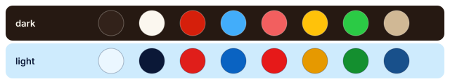

### PlayStation

`"activeTheme": "playstation"` - PS1 console gray (light) / charcoal blue-black (dark), PlayStation-blue accent with circle-red and triangle-green status colors. Spinner: the four controller button symbols in a diamond, spinning

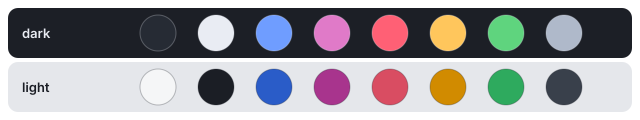

### Game Boy

`"activeTheme": "gameboy"` - DMG shell gray with magenta buttons (light) / pea-green LCD (dark). Spinner: the d-pad, pulsing

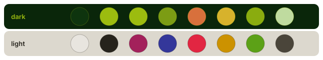

### Final Fantasy

`"activeTheme": "final-fantasy"` - parchment cream with menu-blue accent (light) / the classic menu blue with a crystal-gold accent (dark). Spinner: a faceted crystal, pulsing

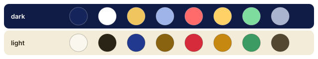

### Zelda

`"activeTheme": "zelda"` - pale parchment green with forest-green accent (light) / deep forest green with gold (dark). Spinner: a two-frame walking hero silhouette, sword raised

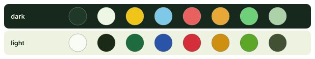

### Warcraft

`"activeTheme": "warcraft"` - parchment gold with Alliance-blue accent (light) / dark brown with gold, orc-green success (dark). Spinner: a two-frame peon swinging a pick

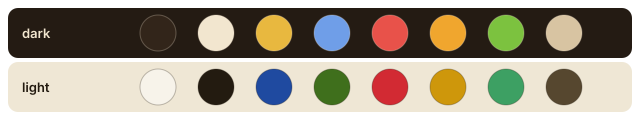

### Dragon Ball

`"activeTheme": "dragonball"` - white over a sky backdrop with an orange accent (light) / deep blue with bright orange (dark). Spinner: the 4-star dragon ball, spinning - its orange and red are pinned, so the ball keeps its own colors in both variants

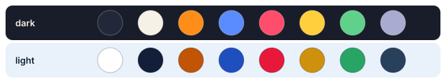

## Community palettes

84 palettes converted from the
[Noctalia community-palettes](https://github.com/noctalia-dev/community-palettes)
collection. Each carries a curated spinner glyph alongside its colors - 53 distinct
designs across the 84 slugs, because families share a shape on purpose (one great-wave
curl for the Kanagawa palettes, one curled cat for the Catppuccin accent variants).

### A

#### ADW

`"activeTheme": "adw"`

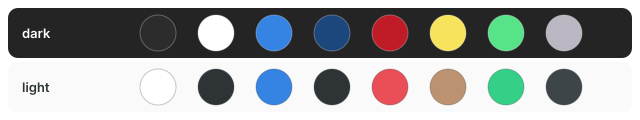

#### Atuel

`"activeTheme": "atuel"`

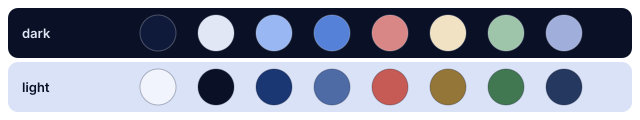

#### Ayu Blue

`"activeTheme": "ayu-blue"`

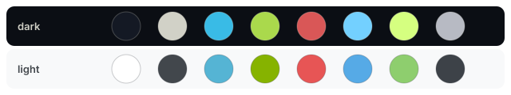

#### Ayu Green

`"activeTheme": "ayu-green"`

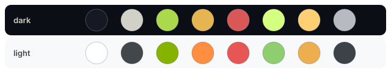

#### Ayu Red

`"activeTheme": "ayu-red"`

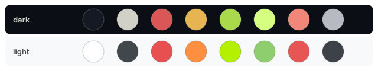

### B

#### Breeze

`"activeTheme": "breeze"`

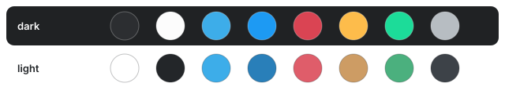

### C

#### Catppuccin Frappe Blue

`"activeTheme": "catppuccin-frappe-blue"`

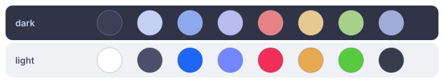

#### Catppuccin Frappe Lavender

`"activeTheme": "catppuccin-frappe-lavender"`

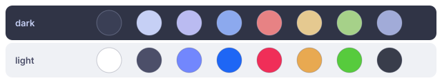

#### Catppuccin Frappe Mauve

`"activeTheme": "catppuccin-frappe-mauve"`

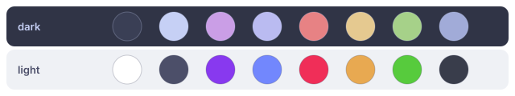

#### Catppuccin Frappe Pink

`"activeTheme": "catppuccin-frappe-pink"`

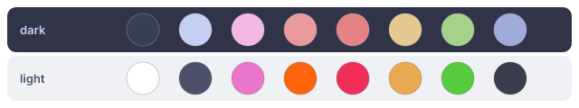

#### Catppuccin Frappe Rosewater

`"activeTheme": "catppuccin-frappe-rosewater"`

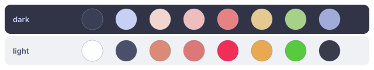

#### Catppuccin Frappe Sapphire

`"activeTheme": "catppuccin-frappe-sapphire"`

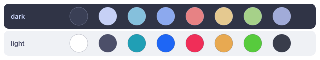

#### Catppuccin Lavender

`"activeTheme": "catppuccin-lavender"`

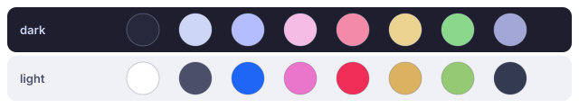

#### Catppuccin Macchiato Lavender

`"activeTheme": "catppuccin-macchiato-lavender"`

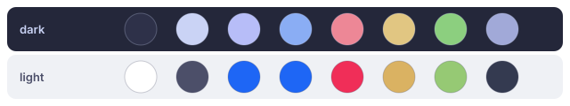

#### Catppuccin Macchiato Mauve

`"activeTheme": "catppuccin-macchiato-mauve"`

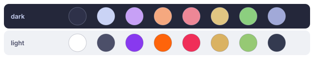

#### Catppuccin Macchiato Pink

`"activeTheme": "catppuccin-macchiato-pink"`

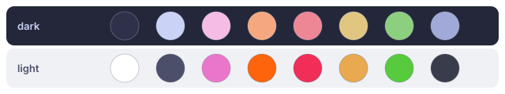

#### Catppuccin Macchiato Rosewater

`"activeTheme": "catppuccin-macchiato-rosewater"`

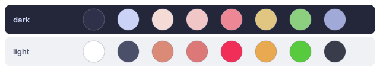

#### Catppuccin Macchiato Sapphire

`"activeTheme": "catppuccin-macchiato-sapphire"`

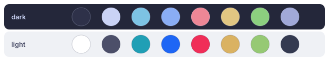

#### Catppuccin Mocha Pink

`"activeTheme": "catppuccin-mocha-pink"`

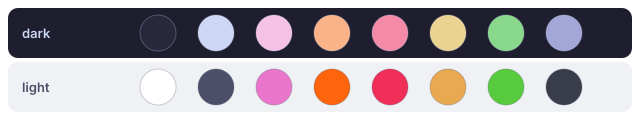

#### Catppuccin Mocha Rosewater

`"activeTheme": "catppuccin-mocha-rosewater"`

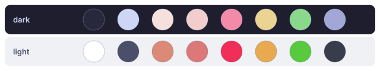

#### Catppuccin Mocha Sapphire

`"activeTheme": "catppuccin-mocha-sapphire"`

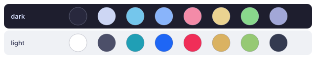

#### Cherry Blossom

`"activeTheme": "cherry-blossom"`

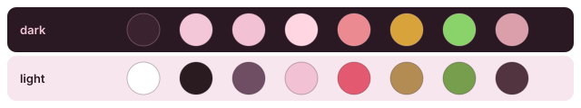

#### Cream

`"activeTheme": "cream"`

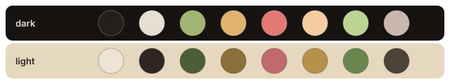

#### Cream Autumn

`"activeTheme": "cream-autumn"`

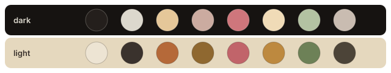

#### Creamy Forest

`"activeTheme": "creamy-forest"`

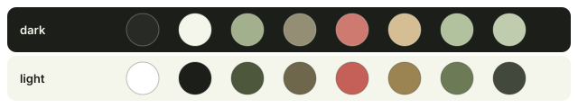

#### Cyberpunk

`"activeTheme": "cyberpunk"`

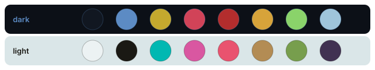

### D

#### Doomed

`"activeTheme": "doomed"`

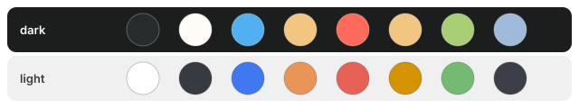

### E

#### Espresso Cream

`"activeTheme": "espresso-cream"`

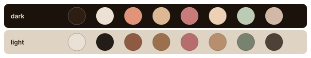

#### Everdeer

`"activeTheme": "everdeer"`

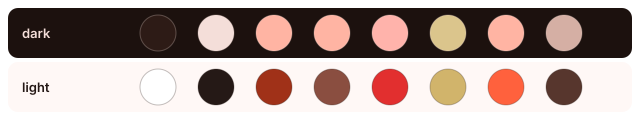

#### Everforest

`"activeTheme": "everforest"`

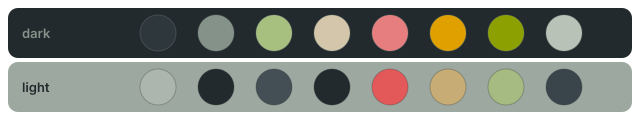

#### Everforest Alt

`"activeTheme": "everforest-alt"`

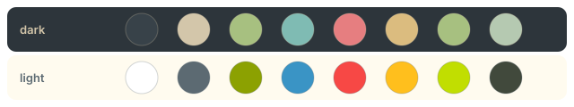

#### Everforest Material

`"activeTheme": "everforest-material"`

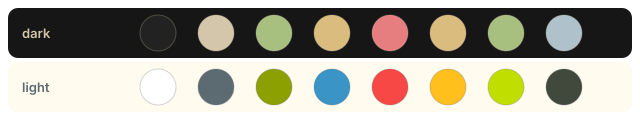

### F

#### Flexoki

`"activeTheme": "flexoki"`

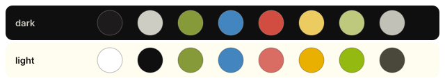

### G

#### Garnet

`"activeTheme": "garnet"`

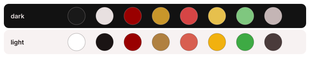

#### GitHub Dark

`"activeTheme": "github-dark"`

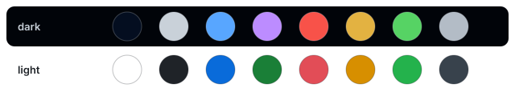

#### Gruber Darker

`"activeTheme": "gruber-darker"`

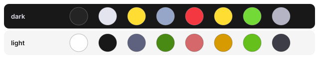

#### Gruvbox Material

`"activeTheme": "gruvbox-material"`

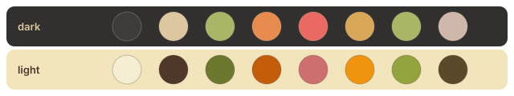

#### GruvboxAlt

`"activeTheme": "gruvboxalt"`

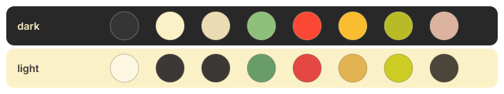

### H

#### Hexa34C

`"activeTheme": "hexa34c"`


#### Horizon

`"activeTheme": "horizon"`


### J

#### Jiva

`"activeTheme": "jiva"`


#### Jiva Lotus

`"activeTheme": "jiva-lotus"`


#### Jiva Paper

`"activeTheme": "jiva-paper"`


### K

#### Kanagawa Dragon

`"activeTheme": "kanagawa-dragon"`


#### Kanagawa Kasumi

`"activeTheme": "kanagawa-kasumi"`


#### Kanagawa Paper

`"activeTheme": "kanagawa-paper"`


#### Kemuri

`"activeTheme": "kemuri"`


#### Kemuri Koke

`"activeTheme": "kemuri-koke"`


#### Kemuri Susu

`"activeTheme": "kemuri-susu"`


### L

#### Lilac AMOLED

`"activeTheme": "lilac-amoled"`


### M

#### Macaron

`"activeTheme": "macaron"`


#### Matecito

`"activeTheme": "matecito"`


#### Miasma

`"activeTheme": "miasma"`


#### Mine

`"activeTheme": "mine"`


#### Mizuki-Akiyama

`"activeTheme": "mizuki-akiyama"`


#### Monochrome

`"activeTheme": "monochrome"`


#### Murasaki

`"activeTheme": "murasaki"`


#### Murata

`"activeTheme": "murata"`


### N

#### NaySayer

`"activeTheme": "naysayer"`


#### Neon Surf

`"activeTheme": "neon-surf"`


#### Noctalia legacy

`"activeTheme": "noctalia-legacy"`


#### Nord Aurora

`"activeTheme": "nord-aurora"`


### O

#### Oasis Abyss

`"activeTheme": "oasis-abyss"`


#### Occult Umbral

`"activeTheme": "occult-umbral"`


#### One

`"activeTheme": "one"`


#### One Dark Two

`"activeTheme": "one-dark-two"`


#### Osaka jade

`"activeTheme": "osaka-jade"`


#### Oxide

`"activeTheme": "oxide"`


#### Oxocarbon

`"activeTheme": "oxocarbon"`


### P

#### Paradise

`"activeTheme": "paradise"`


#### Peche

`"activeTheme": "peche"`


### R

#### Rose Pine Alt

`"activeTheme": "rose-pine-alt"`


#### Rose Pine Moon

`"activeTheme": "rose-pine-moon"`


#### Rose Pine Moon Alt

`"activeTheme": "rose-pine-moon-alt"`


#### Rosey AMOLED

`"activeTheme": "rosey-amoled"`


### S

#### Shien

`"activeTheme": "shien"`


#### Shinonome

`"activeTheme": "shinonome"`


#### Solarized

`"activeTheme": "solarized"`


#### Solarized Osaka

`"activeTheme": "solarized-osaka"`


#### Sway Classic

`"activeTheme": "sway-classic"`


### T

#### Tokyo Night Moon

`"activeTheme": "tokyo-night-moon"`


#### Tokyo Night Storm

`"activeTheme": "tokyo-night-storm"`


### V

#### Vesper

`"activeTheme": "vesper"`


### Z

#### Zenbones

`"activeTheme": "zenbones"`


## Notes on specific palettes

- **Lilac AMOLED**, **Rosey AMOLED** and **Neon Surf** use a pure-black background by
  design. The surface ladder is intentionally flat; panels still lift slightly above
  the content pane.
- **Everforest**, **Osaka jade**, **Kemuri Susu**, **Kanagawa Dragon** and **Kanagawa
  Kasumi** have muted mid-tone light variants rather than bright ones - that is the
  source palette, not a conversion artifact.
- **Peche**, **Monochrome**, **Solarized** and the light variants of **Tokyo Night
  Moon** and **Tokyo Night Storm** carry the lower text contrast of their source
  palettes. If you want more separation, copy the palette into your own `themes`
  entry and darken (light variant) or lighten (dark variant) `--text-000`/`--text-100`.
- The three Catppuccin flavours that ship as built-ins (`catppuccin-mocha`,
  `catppuccin-macchiato`, `catppuccin-frappe`) all pair with **Latte** as their light
  variant, because Catppuccin defines a single light flavour. The community
  Catppuccin entries here are its accent variants.

## Credits

The community palettes come from the
[Noctalia community-palettes](https://github.com/noctalia-dev/community-palettes)
project and its contributors. They are converted to Claude Desktop token sets by
`scripts/generate-community-themes.mjs`, which also renders the swatch cards on this
page; the full role-to-token mapping is documented in that script's header. To
regenerate after the collection changes:

```bash
node scripts/generate-community-themes.mjs /path/to/community-palettes
```
